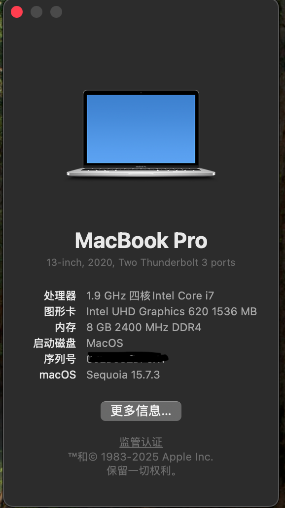

# T480s-hackintosh
这是我自用的一套黑苹果efi（macos15）
# 
 Hackintosh ThinkPad T480s 

<b>OpenCore EFI for Lenovo ThinkPad T480s (i5-8350U, Intel UHD 620) with Touchscreen</b>

### 我不是很擅长使用github，在这里提前感谢一下github上面诸多先驱的支持。
---

---

## 📢 提示：

---

## 🚀 快速开始
### 1. 下载 EFI
从[Releases](../../releases)下载我的EFI文件

### 2. 修改SMBIOS
- 我这个efi使用的是macos15，推荐你们选择: `MacBookPro16,3`
---

## 💻 设备信息

| Component | Details |
|----------:|:--------|
| **型号** | Lenovo ThinkPad T480s |
| **CPU** | Intel Core i5-8350U (4C/8T, 1.9GHz, Turbo 3.6GHz) |
| **iGPU** | Intel UHD Graphics 620 |
| **RAM** | 1×8GB DDR4 2400MHz |
| **SSD** | SN550 M.2 2280 1TB |
| **Display** | eDP 14" FHD 1920×1080 with Touchscreen |
| **Audio** | Realtek ALC257 |
| **Ethernet** | Intel I219-LM |
| **WiFi/BT** | Intel Wireless-AC 8265 |
| **Camera** | 720p HD |
| **Trackpad** | Synaptics Precision (PS2/SMBus) |

---

## 🪛 BIOS Settings

| Menu Path | Setting |
|:----------|--------:|
| Config > USB > Always On USB | **Disabled** |
| Config > Keyboard/Mouse > Trackpoint | **Enabled** |
| Config > Keyboard/Mouse > Trackpad | **Enabled** |
| Config > Keyboard/Mouse > Fn and Ctrl Key swap | **Disabled** |
| Config > Keyboard/Mouse > Fn Sticky Key | **Disabled** |
| Config > Keyboard/Mouse > F1-F12 as Primary Function | **Disabled** |
| Config > Display > Boot Display Device | **Thinkpad LCD** |
| Config > Display > Shared Display Priority | **USB Type-C** |
| Config > Display > Total Graphics Memory | **512MB** |
| Config > Power > Intel SpeedStep Technology | **Enabled** |
| Config > CPU > Intel Hyper-Threading Technology | **Enabled** |
| Config > Thunderbolt 3 > Thunderbolt BIOS Assist Mode | **Enabled** |
| Config > Thunderbolt 3 > Security Level | **No Security** |
| Config > Thunderbolt 3 > Wake by Thunderbolt 3 | **Enabled** |
| Config > Thunderbolt 3 > Support in Pre Boot Environment | **Enabled** |
| Security > Security Chip | **Disabled** |
| Security > Memory Protection > Execution Prevention | **Enabled** |
| Security > Virtualization > Intel VT | **Enabled** |
| Security > Virtualization > Intel VT-d | **Enabled** |
| Security > I/O Port Access > Fingerprint Reader | **Disabled** |
| Security > Secure Boot | **Disabled** |
| Security > Intel SGX | **Software Controlled** |
| Security > Device Guard | **Disabled** |
| Boot > UEFI/Legacy Boot | **Both** |
| Boot > UEFI/Legacy Boot Priority | **Legacy First** |
| Boot > CSM Support | **Yes** |

---

## 📊 Status

<b>✅ 正常使用</b>

| Feature | Notes |
|---------|-------|
| QE/CI & Hardware Acceleration | IQSV fully supported |
| Battery Management | Accurate percentage |
| CPU Power Management | Performance optimized |
| USB-A & USB-C | Including power delivery |
| HDMI Output | Video & audio |
| Audio | Speaker, internal mic, 3.5mm jack |
| WiFi 5GHz & 2.4GHz | Supported with Airdrop, Continuity, etc. |
| Bluetooth | Fully functional |
| Ethernet | Intel I219-LM |
| Trackpad & Trackpoint | Full gesture support |
| Touchscreen | Same as Trackpad, multi-gesture support |
| Keyboard & Backlight | All keys working |
| Internal Webcam | 720p HD |
| Sleep/Wake | Stable |
| ThinkPad Fn Keys | F1-F12 via YogaSMC |
| iServices | iMessage, FaceTime, App Store, Find My |
| Apple Music | Lossless/Hi-Res supported |
| Airdrop | Send to iPhone only |
| Continuity/Handoff | Universal Clipboard, etc. |
| iPhone Camera | USB cable |
| Android USB Tethering | HoRNDIS included |

<b>❌ 无法正常工作</b>

| Feature | Reason |
|---------|--------|
| Safari DRM / Apple TV+ | Requires dGPU (workaround: Chrome/Firefox with Widevine) |
| Fingerprint Reader | No macOS driver |
| Airdrop Receiver | Intel WiFi limitation |
| iPhone Camera (Wireless) | Requires native AirDrop |

<b>🔍 没有测试</b>

- Thunderbolt 3 (no device to test)
- Card Reader (no memory card)
- WWAN (no card installed)

---

## 🛠️ 使用到的工具

| Tool | Description |
|------|-------------|
| [ProperTree](https://github.com/corpnewt/ProperTree) | Plist editor |
| [Hackintool](https://github.com/benbaker76/Hackintool) | System info & patches |
| [OCAuxiliaryTools](https://github.com/ic005k/OCAuxiliaryTools) | OpenCore config editor |
| [HiDPI](https://github.com/xzhih/one-key-hidpi) | One-key HiDPI script |
| [MyKextInstaller](https://github.com/Mirone/MyKextInstaller) | Kext installer (Tahoe audio) |
| [Python3](https://www.python.org/downloads/macos/) | For scripts |
| [Homebrew](https://brew.sh/) | Package manager |

---

## 📸 截图

